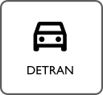

Este é um experimento com o intuito de criar um guia colaborativo sobre como fazer as coisas acontecerem na cidade. 
Seja encontrando um prestador de serviço ou aquela loja com aquele item super especifico. 
Ou ainda entendo as diversas burocracias dos serviços públicos através das experiências de quem já navegou por ali.
Esta é uma biblioteca construida pela comunidade para a comunidade.

## Veja também

[Como Usar o Guia](sobre/){ .md-button }
[Horários de Ônibus](onibus/){ .md-button }
[Onde Pegar Ônibus](onibus/#onde-pegar-os-onibus){ .md-button }
[Agendamento DETRAN](detran/#agendar-visita-detran){ .md-button }
[Rebaixamento de Guia](servicos_publicos/#rebaixamento-de-guia){ .md-button }
[Telefones e Contatos](prefeitura/#telefones_publicos){ .md-button }

!!! Dica hint
    Os menus laterais e a caixa de pesquisa são uma forma muito eficiente de descobrir o conteúdo desse guia
